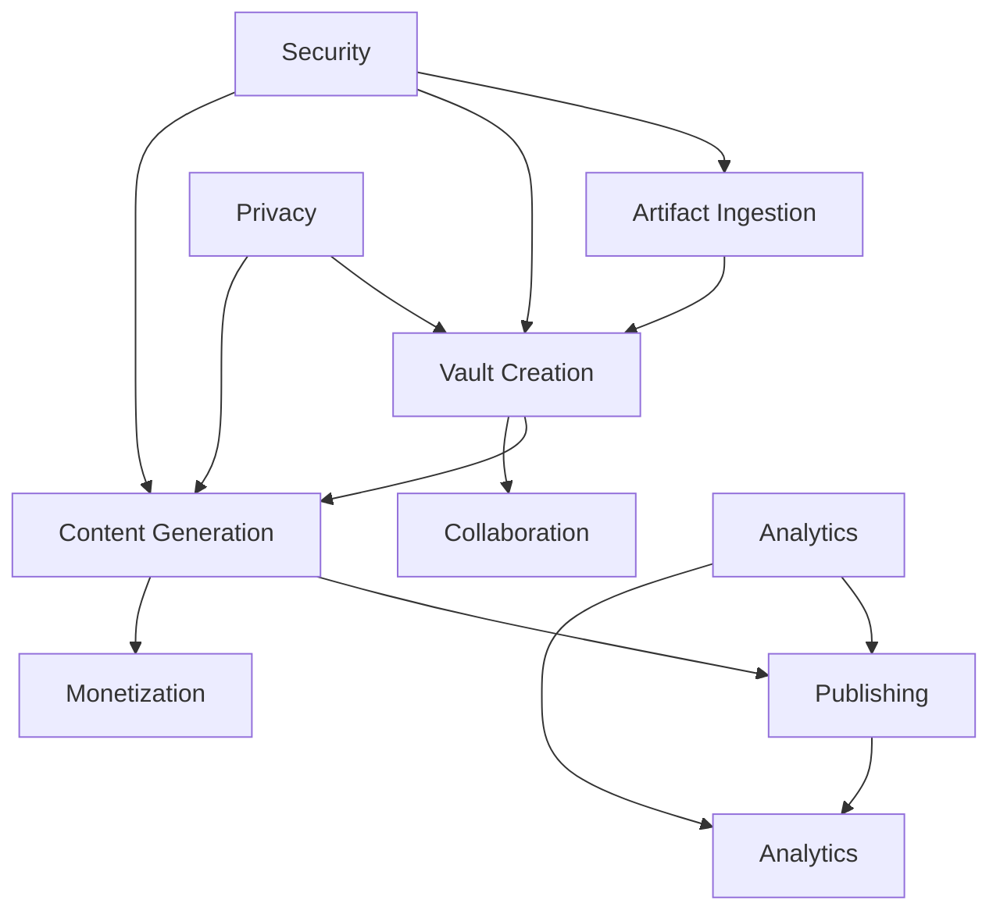

# Molecule/Vault MVP Feature Generation Plan

## Overview
This document outlines the feature groups, dependencies, and implementation details for the Molecule/Vault MVP platform. The plan is organized to ensure all core requirements from the PRD are covered while maintaining clear traceability to business goals.

## Feature Groups

### 1. Artifact Ingestion & Management
**Business Goals:**
- Enable content creators to easily import and manage their source materials
- Support multiple artifact types and formats
- Ensure reliable data extraction and processing

**User Stories:**
- As a content creator, I want to upload various file types (PDF, DOC, TXT, etc.) so I can use them as source materials
- As a content creator, I want to see the status of my uploaded artifacts so I know when they're ready for use
- As a content creator, I want to organize my artifacts with tags and metadata so I can find them easily

**Dependencies:**
- Vector DB integration
- File storage system
- Asynchronous processing pipeline

**Edge Cases:**
- Failed uploads
- Unsupported file types
- Corrupted files
- Large file handling
- Concurrent uploads

### 2. Molecule/Vault Creation & Privacy Controls
**Business Goals:**
- Enable secure content organization
- Provide granular privacy controls
- Support collaboration features

**User Stories:**
- As a content creator, I want to create Vaults to organize my content
- As a content creator, I want to set privacy levels for my Vaults
- As a content creator, I want to invite collaborators to my Vaults

**Dependencies:**
- Authentication system (Logto)
- Role-based access control
- Encryption system

**Edge Cases:**
- Permission conflicts
- Role limit enforcement
- Vault deletion with active content

### 3. Content Product Generation & Publishing
**Business Goals:**
- Enable AI-assisted content creation
- Support multiple output formats
- Ensure quality and consistency

**User Stories:**
- As a content creator, I want to generate content products from my artifacts
- As a content creator, I want to customize the output format
- As a content creator, I want to preview and edit generated content

**Dependencies:**
- AI microservices
- Content generation pipeline
- Publishing system

**Edge Cases:**
- Generation failures
- Content quality issues
- Publishing errors
- Version control

### 4. Real-Time Analytics & Engagement Dashboard
**Business Goals:**
- Provide insights into content performance
- Enable data-driven decisions
- Track user engagement

**User Stories:**
- As a content creator, I want to see engagement metrics for my content
- As a content creator, I want to track audience growth
- As a content creator, I want to receive performance alerts

**Dependencies:**
- Analytics pipeline
- Real-time processing
- Dashboard system

**Edge Cases:**
- Data delays
- Metric calculation errors
- High traffic handling

### 5. Trust, Verification & Collaboration
**Business Goals:**
- Build trust in the platform
- Enable content verification
- Support community features

**User Stories:**
- As a user, I want to verify content authenticity
- As a content creator, I want to build my reputation
- As a user, I want to collaborate with other creators

**Dependencies:**
- Verification system
- Reputation tracking
- Collaboration tools

**Edge Cases:**
- Dispute resolution
- Reputation manipulation
- Collaboration conflicts

### 6. Automation & Integrations
**Business Goals:**
- Streamline workflows
- Connect with external tools
- Enable automated processes

**User Stories:**
- As a content creator, I want to automate routine tasks
- As a content creator, I want to integrate with my existing tools
- As a content creator, I want to set up automated publishing

**Dependencies:**
- Integration framework
- Automation engine
- API system

**Edge Cases:**
- Integration failures
- Rate limiting
- Authentication issues

### 7. Payments & Monetization
**Business Goals:**
- Enable content monetization
- Support multiple payment methods
- Handle revenue sharing

**User Stories:**
- As a content creator, I want to set prices for my content
- As a content creator, I want to receive payments
- As a user, I want to purchase content

**Dependencies:**
- Payment processing
- Revenue tracking
- Subscription system

**Edge Cases:**
- Payment failures
- Refund handling
- Currency conversion

## Cross-Cutting Concerns

### Security
- End-to-end encryption
- Role-based access control
- Audit logging
- GDPR compliance
- Data protection

### Privacy
- Vault visibility controls
- Data export/deletion
- Consent management
- Privacy policy enforcement

### Analytics
- Event tracking
- Real-time updates
- Performance monitoring
- Usage analytics

### Scalability
- Asynchronous processing
- Microservices architecture
- Feature flags
- Load balancing
- Caching strategy

## MVP Scope

### In Scope
- Basic artifact ingestion
- Core Vault creation and privacy
- Essential content generation
- Basic analytics
- Fundamental security features
- Core payment processing

### Deferred to Future Releases
- Advanced collaboration features
- Complex automation workflows
- Advanced analytics
- Premium monetization features
- Advanced integration options

## Dependency Graph

## Implementation Notes
- Use feature flags for gradual rollout
- Implement monitoring from day one
- Focus on core user journeys first
- Build with scalability in mind
- Maintain comprehensive documentation
- Regular security audits
- Performance testing throughout

## Next Steps
1. Review and validate feature groups with stakeholders
2. Create detailed user stories for MVP features
3. Set up project management board
4. Begin technical architecture design
5. Establish development milestones 